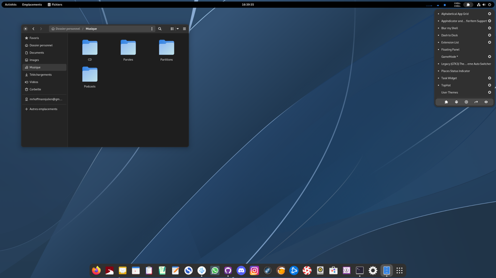
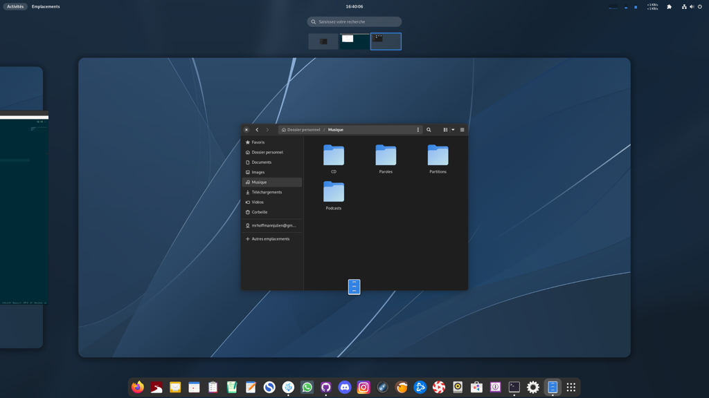
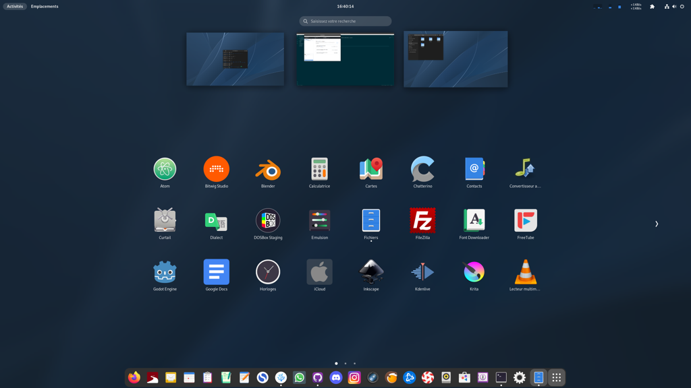

# Script d'installation de mon Fedora Workstation

### PréRequis
1/ Fedora Workstation avec GNOME
2/ Une connection internet     
3/ Une tasse de chocolat chaud, le temps de l'installation ;)    

### Installation
1/ Télécharger le script    
2/ Dezippez-le
3/ Ouvrir le terminal à l'endroit où se trouve le dossier "installationFWD"
4/ ```chmod -R 755 FWS```    
5/ lancer le script ```./"FWS/startFedo.sh"```       
6/ Une fois les script terminé, il est recommandé de redémarrer le système.     

  
  
  
